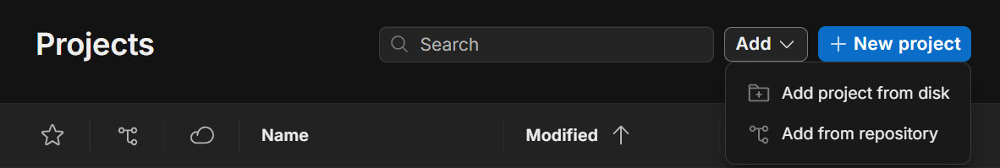

# GameProjectHY
The name is still to be decided

## Installation guide

1. Clone the project. In a terminal:
```
git clone https://github.com/Mrivu/GameProjectHY.git
```
The git folder(GameProjectHY) is now found at the location where you ran the command.
To get the latest changes after cloning, run the following in the git folder.
```
git pull
```

2. Open Unity Hub and check that you have Unity 6000.4.1f1 installed.
Install Unity 6000.4.1f1: 
```
https://unity.com/releases/editor/whats-new/6000.4.1f1
```
Then, add the git folder to unity hub. It is found under Users/username


3. Open the project. When editing, make sure to do so on the correct branch. Main is used for programming, but other branches include:
- Dialogue

See below for guides on each branch. 


### Branch guide : Dialogue
1. To swtich to a branch, use
```
git checkout <branch_name>
```
with the branch_name being Dialogue for this instance.

2. After making changes, run the following commands.
```
git status
```
This shows all the things you changed. Add a change with:
```
git add <change_to_add>
```
Or use
```
git add .
```
to add all of your changes.

Then, run:
```
git commit -m <message>
```
which creates a commit of your added changes. The message is a very brief summary of what you did, like: "add dialogue for NPC1". These messages are written in present tense.

Finally, run:
```
git push
```
to send the changes to the repository.

3. To add dialogue, find the TextData script in Assets/Scripts/TextData.cs 
Dialogues aka conversations are sorted by ID. A converastion ends when there aren't any choices to make, and switches when a choice is made.

The text is stored like so:
```
Dictionary<int, ArrayList>
```
meaning an unique ID corresponding to a list of text.

There are two types of text: TextEntry and DialogueChoices.
TextEntry has the following fields:
- text: What is said
- playerSprite: Mood of the player
- talkTargetSprite: Mood of the talkTarget/NPC
- Speaking talker: Who says the line

DialogueChoices is a list of tuples containing two values: the text and the id of the next conversation.
Place all dialogue choices into that list. Each conversation should only have 1 DialogueChoices component.

Note: If Mood is set to None, that character doesn't appear.

For an example, look at the conversation with ID = 0 in ther script.
